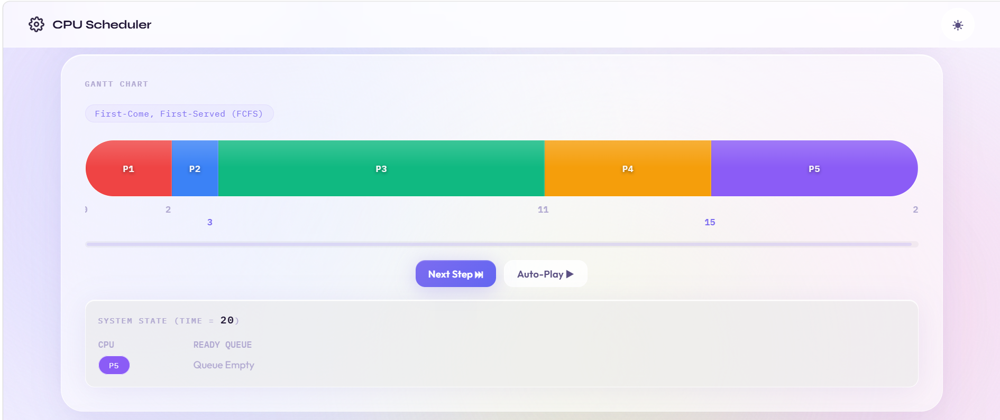
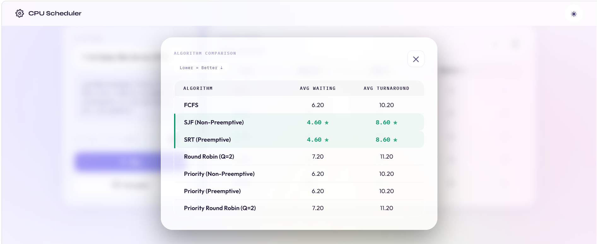
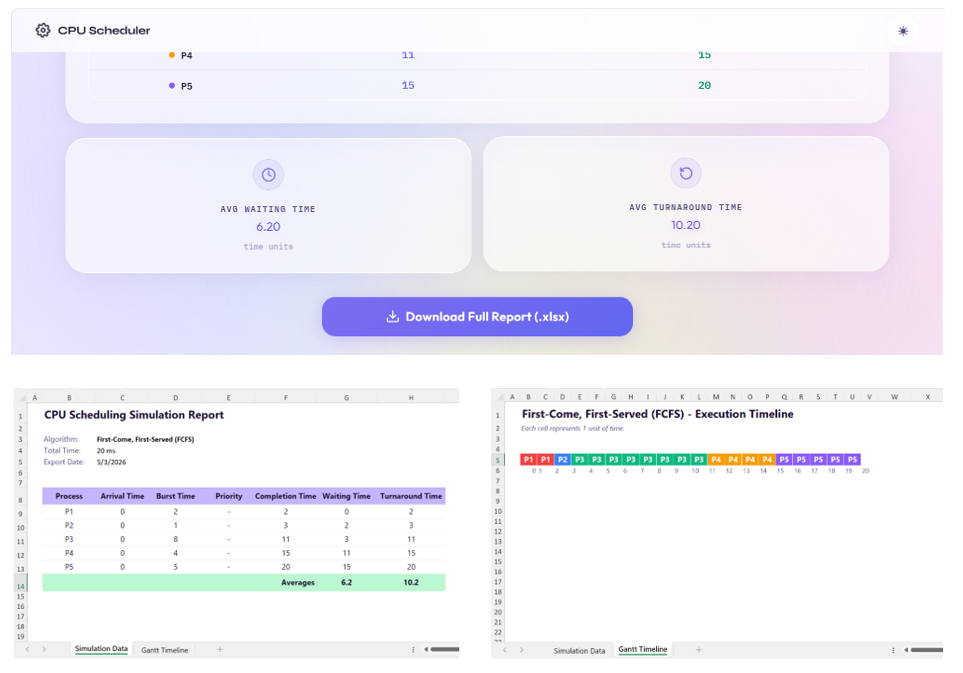

# 🖥️ CPU Scheduling Simulator

A web-based, interactive CPU scheduling simulator that visualizes how operating systems manage process execution. Built with vanilla JavaScript using a clean modular architecture — no frameworks, no dependencies beyond a charting utility.

---

## ✨ Features

### 7 Scheduling Algorithms
| Algorithm | Type |
|---|---|
| First Come First Served (FCFS) | Non-Preemptive |
| Shortest Job First (SJF) | Non-Preemptive |
| Shortest Remaining Time (SRT) | Preemptive |
| Round Robin (RR) | Preemptive |
| Priority Scheduling | Non-Preemptive |
| Priority Scheduling | Preemptive |
| Priority Round Robin | Preemptive |

### 🎬 Step-by-Step Playback Mode
Watch the scheduler execute in real time — step through each CPU tick manually or let it auto-play. The system state panel updates live showing which process is running, waiting, or idle at every unit of time.

### 📊 Algorithm Comparison
Run all 7 algorithms on the same process set simultaneously and compare their **Average Waiting Time** and **Average Turnaround Time** side by side. Best-performing results are highlighted automatically.

### 📤 Excel Export
Export a fully formatted `.xlsx` report with two sheets:
- **Simulation Data** — process table with completion, waiting, and turnaround times
- **Gantt Timeline** — color-coded execution timeline where each cell represents one time unit

### 🧮 Per-Process Metrics
For every simulation, each process reports:
- Arrival Time, Burst Time, Priority
- Completion Time (CT)
- Waiting Time (WT)
- Turnaround Time (TAT)
- Response Time

---

## 🚀 Getting Started

This project runs entirely in the browser — no build step required.

```bash
git clone https://github.com/niceby-x/cpu-scheduling-simulator.git
cd cpu-scheduling-simulator
```

Then open `index.html` in your browser, or serve it with any static file server:

```bash
# Using Python
python -m http.server 8000

# Using Node.js
npx serve .
```

> ⚠️ Because the project uses ES Modules (`import`/`export`), it must be served over HTTP — opening `index.html` directly as a `file://` URL will not work.

---

## 🗂️ Project Structure

```
📁 CPU SCHEDULING SIMULATOR
├── 📁 assets              # Images used in the system
│   └── images.png           
├── 📁 CSS
│   └── style.css           # All styling and layout
├── 📁 JavaScript
│   ├── algorithms.js       # Pure scheduling algorithm implementations
│   ├── export.js           # Excel report generation via ExcelJS
│   ├── main.js             # Central orchestrator, event listeners, playback logic
│   └── ui.js               # DOM rendering, Gantt chart, table, toast notifications
└── index.html              # App shell and markup
└── README.md
```

The codebase follows a clean separation of concerns:

- **`algorithms.js`** is pure logic — no DOM access, fully testable
- **`ui.js`** owns all rendering and display state
- **`main.js`** wires everything together and manages application state
- **`export.js`** handles the Excel pipeline independently

---

## 🔬 How the Algorithms Work

### Non-Preemptive (FCFS, SJF, Priority NP)
Once a process starts, it runs to completion. The scheduler picks the next process from the ready queue based on the algorithm's criterion (arrival order, shortest burst, or highest priority).

### Preemptive (SRT, Priority P)
The scheduler re-evaluates at every clock tick. If a higher-priority (or shorter-remaining) process arrives, the current process is interrupted and moved back to the ready queue.

### Round Robin (RR, Priority RR)
Each process gets a fixed **time quantum**. If it doesn't finish within the quantum, it's re-queued. Priority RR extends this by also preempting for a higher-priority arrival mid-quantum.

### Idle Time
All algorithms handle gaps — if no process has arrived yet, an **Idle** block is inserted into the Gantt chart and time advances to the next arrival.

---

## 📸 Screenshots

| Gantt Chart | Comparison Modal | Excel Export |
|---|---|---|
|  |  |  |

---

## 🛠️ Tech Stack

| Layer | Technology |
|---|---|
| Language | Vanilla JavaScript (ES Modules) |
| Styling | Plain CSS with CSS Variables |
| Excel Export | [ExcelJS](https://github.com/exceljs/exceljs) (via CDN) |
| Bundler | None — runs natively in modern browsers |

---

## 🎓 Use Cases

- **Students** studying Operating Systems concepts
- **Educators** demonstrating scheduling behavior in lectures
- **Developers** exploring algorithm tradeoffs on custom process sets

---

## 📄 License

MIT License — free to use, modify, and distribute.

---

## 🤝 Contributing

Pull requests are welcome! If you'd like to add a new algorithm (e.g., Multilevel Queue, HRRN), improve the UI, or fix a bug:

1. Fork the repository at [github.com/niceby-x/cpu-scheduling-simulator](https://github.com/niceby-x/cpu-scheduling-simulator)
2. Create a feature branch: `git checkout -b feature/your-feature`
3. Commit your changes: `git commit -m 'Add: your feature description'`
4. Push and open a Pull Request

---

<p align="center">Made for OS enthusiasts, by an OS enthusiast ☕</p>
